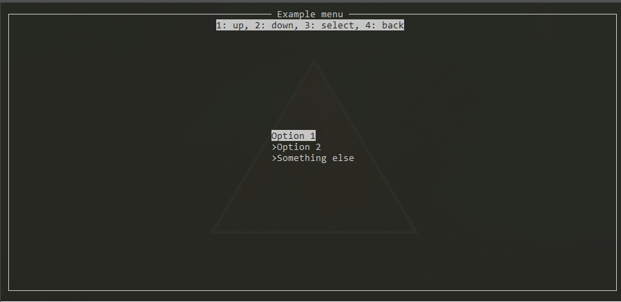

# scmenu
Simple menu class for future python projects. Requires `curses`.

## Usage:
In short:

    choice = scmenu.Menu(str title, list options, str infobar, 
                         str selected, dict settings).show()

- `options` is a list containing pairs of `('OptionName', 'optioncommand')`
- When an item is selected, the `optioncommand` of the selected option is returned
- Pressing `back` (default 4) will return `back` (useful for nesting menus)
- String argument `infobar` sets the text of the information bar at the top (default '')
- Int argument `selected` pre-defines the selected item number (default 0)
- Dict argument `settings` changes some other settings. Please refer to docstring.
- Cannot be used in interactive mode

## Example:

    sampleSettings = {'keys': ('1', '2', '3', '4'), 'bullet': '>'}
    sampleOptions = [('Option 1', 5),
                    ('Option 2', 'opt2'),
                    ('Something else', 'opt3')]
    sampleBar = '1: up, 2: down, 3: select, 4: back'
    sampleMenu = Menu('Example menu', sampleOptions, sampleBar,
                    0, sampleSettings)
    print sampleMenu.show()

Generates:

A working example is contained in `example.py`

## Documentation
All other documentation is included in the docstring

## License
BSD Style
